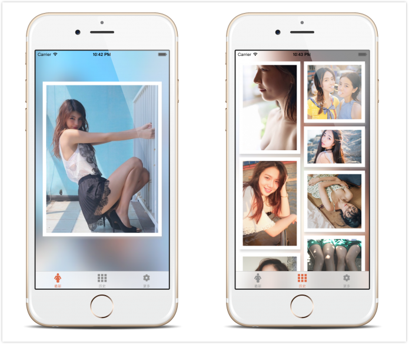

# 

It's a project made while I'm learning Swift. The data is fetched from [http://gank.io/](http://gank.io/) by [@daimajia](https://github.com/daimajia).

### demo

### keywords

* [Carthage](https://github.com/Carthage/Carthage)
* [Kingfisher](https://github.com/onevcat/Kingfisher)
* [CHTCollectionViewWaterfallLayout](https://github.com/chiahsien/CHTCollectionViewWaterfallLayout)
* `UIBlurEffect`
* `NSURLConnection`
* Sketch

### License

The MIT (buy me coffee) License (MIT)

